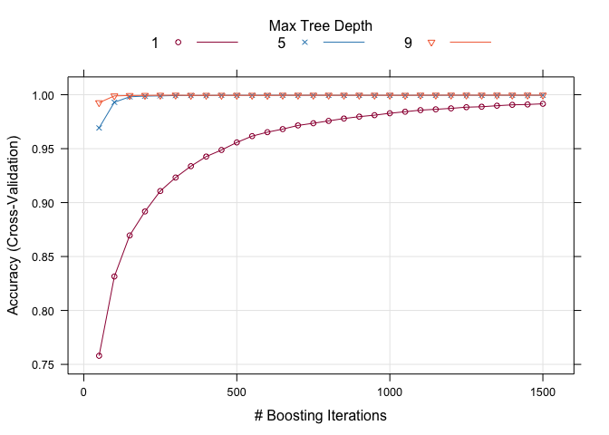

## Introduction

Using devices such as Jawbone Up, Nike FuelBand, and Fitbit it is now possible to collect a large amount of data about personal activity relatively inexpensively. These type of devices are part of the quantified self movement – a group of enthusiasts who take measurements about themselves regularly to improve their health, to find patterns in their behavior, or because they are tech geeks. One thing that people regularly do is quantify how much of a particular activity they do, but they rarely quantify how well they do it.

The goal of this project is to recognize human weight lifting activity using data from accelertometers on the belt, forearm, arm, and dumbell of 6 participants. More information about the human activity recognition is available [here](http://groupware.les.inf.puc-rio.br/har).

## Required packages

```r
library(tidyverse)
library(caret)
library(gbm)
```

## Data importing


```r
download_training <- function(){      
      file_name <- "pml-training.csv"
      if (!file.exists(file_name)) {
            file_url <- "https://d396qusza40orc.cloudfront.net/predmachlearn/pml-training.csv"
            download.file(file_url, file_name, method = "curl")
      }
}

download_testing <- function(){      
      file_name <- "pml-testing.csv"
      if (!file.exists(file_name)) {
            file_url <- "https://d396qusza40orc.cloudfront.net/predmachlearn/pml-testing.csv"
            download.file(file_url, file_name, method = "curl")
      }
}

download_training()
download_testing()

training_raw <- read.csv("pml-training.csv", na = c("", "NA"))
testing_raw <- read.csv("pml-testing.csv", na = c("", "NA")) 
```

## Data preprocessing


```r
dim(training_raw)
```

```
## [1] 19622   160
```


```r
colnames(training_raw)
```

```
##   [1] "X"                        "user_name"               
##   [3] "raw_timestamp_part_1"     "raw_timestamp_part_2"    
##   [5] "cvtd_timestamp"           "new_window"              
##   [7] "num_window"               "roll_belt"               
##   [9] "pitch_belt"               "yaw_belt"                
##  [11] "total_accel_belt"         "kurtosis_roll_belt"      
##  [13] "kurtosis_picth_belt"      "kurtosis_yaw_belt"       
##  [15] "skewness_roll_belt"       "skewness_roll_belt.1"    
##  [17] "skewness_yaw_belt"        "max_roll_belt"           
##  [19] "max_picth_belt"           "max_yaw_belt"            
##  [21] "min_roll_belt"            "min_pitch_belt"          
##  [23] "min_yaw_belt"             "amplitude_roll_belt"     
##  [25] "amplitude_pitch_belt"     "amplitude_yaw_belt"      
##  [27] "var_total_accel_belt"     "avg_roll_belt"           
##  [29] "stddev_roll_belt"         "var_roll_belt"           
##  [31] "avg_pitch_belt"           "stddev_pitch_belt"       
##  [33] "var_pitch_belt"           "avg_yaw_belt"            
##  [35] "stddev_yaw_belt"          "var_yaw_belt"            
##  [37] "gyros_belt_x"             "gyros_belt_y"            
##  [39] "gyros_belt_z"             "accel_belt_x"            
##  [41] "accel_belt_y"             "accel_belt_z"            
##  [43] "magnet_belt_x"            "magnet_belt_y"           
##  [45] "magnet_belt_z"            "roll_arm"                
##  [47] "pitch_arm"                "yaw_arm"                 
##  [49] "total_accel_arm"          "var_accel_arm"           
##  [51] "avg_roll_arm"             "stddev_roll_arm"         
##  [53] "var_roll_arm"             "avg_pitch_arm"           
##  [55] "stddev_pitch_arm"         "var_pitch_arm"           
##  [57] "avg_yaw_arm"              "stddev_yaw_arm"          
##  [59] "var_yaw_arm"              "gyros_arm_x"             
##  [61] "gyros_arm_y"              "gyros_arm_z"             
##  [63] "accel_arm_x"              "accel_arm_y"             
##  [65] "accel_arm_z"              "magnet_arm_x"            
##  [67] "magnet_arm_y"             "magnet_arm_z"            
##  [69] "kurtosis_roll_arm"        "kurtosis_picth_arm"      
##  [71] "kurtosis_yaw_arm"         "skewness_roll_arm"       
##  [73] "skewness_pitch_arm"       "skewness_yaw_arm"        
##  [75] "max_roll_arm"             "max_picth_arm"           
##  [77] "max_yaw_arm"              "min_roll_arm"            
##  [79] "min_pitch_arm"            "min_yaw_arm"             
##  [81] "amplitude_roll_arm"       "amplitude_pitch_arm"     
##  [83] "amplitude_yaw_arm"        "roll_dumbbell"           
##  [85] "pitch_dumbbell"           "yaw_dumbbell"            
##  [87] "kurtosis_roll_dumbbell"   "kurtosis_picth_dumbbell" 
##  [89] "kurtosis_yaw_dumbbell"    "skewness_roll_dumbbell"  
##  [91] "skewness_pitch_dumbbell"  "skewness_yaw_dumbbell"   
##  [93] "max_roll_dumbbell"        "max_picth_dumbbell"      
##  [95] "max_yaw_dumbbell"         "min_roll_dumbbell"       
##  [97] "min_pitch_dumbbell"       "min_yaw_dumbbell"        
##  [99] "amplitude_roll_dumbbell"  "amplitude_pitch_dumbbell"
## [101] "amplitude_yaw_dumbbell"   "total_accel_dumbbell"    
## [103] "var_accel_dumbbell"       "avg_roll_dumbbell"       
## [105] "stddev_roll_dumbbell"     "var_roll_dumbbell"       
## [107] "avg_pitch_dumbbell"       "stddev_pitch_dumbbell"   
## [109] "var_pitch_dumbbell"       "avg_yaw_dumbbell"        
## [111] "stddev_yaw_dumbbell"      "var_yaw_dumbbell"        
## [113] "gyros_dumbbell_x"         "gyros_dumbbell_y"        
## [115] "gyros_dumbbell_z"         "accel_dumbbell_x"        
## [117] "accel_dumbbell_y"         "accel_dumbbell_z"        
## [119] "magnet_dumbbell_x"        "magnet_dumbbell_y"       
## [121] "magnet_dumbbell_z"        "roll_forearm"            
## [123] "pitch_forearm"            "yaw_forearm"             
## [125] "kurtosis_roll_forearm"    "kurtosis_picth_forearm"  
## [127] "kurtosis_yaw_forearm"     "skewness_roll_forearm"   
## [129] "skewness_pitch_forearm"   "skewness_yaw_forearm"    
## [131] "max_roll_forearm"         "max_picth_forearm"       
## [133] "max_yaw_forearm"          "min_roll_forearm"        
## [135] "min_pitch_forearm"        "min_yaw_forearm"         
## [137] "amplitude_roll_forearm"   "amplitude_pitch_forearm" 
## [139] "amplitude_yaw_forearm"    "total_accel_forearm"     
## [141] "var_accel_forearm"        "avg_roll_forearm"        
## [143] "stddev_roll_forearm"      "var_roll_forearm"        
## [145] "avg_pitch_forearm"        "stddev_pitch_forearm"    
## [147] "var_pitch_forearm"        "avg_yaw_forearm"         
## [149] "stddev_yaw_forearm"       "var_yaw_forearm"         
## [151] "gyros_forearm_x"          "gyros_forearm_y"         
## [153] "gyros_forearm_z"          "accel_forearm_x"         
## [155] "accel_forearm_y"          "accel_forearm_z"         
## [157] "magnet_forearm_x"         "magnet_forearm_y"        
## [159] "magnet_forearm_z"         "classe"
```

### Missing value analysis


```r
missing_values <- training_raw %>%
      gather(key = "key", value = "val") %>%
      mutate(is.missing = is.na(val)) %>%
      group_by(key, is.missing) %>%
      summarize(num_missing = n()) %>%
      filter(is.missing == TRUE) %>%
      select(-is.missing) %>%
      arrange(desc(num_missing))
missing_values
```

```
## # A tibble: 100 x 2
## # Groups:   key [100]
##    key                      num_missing
##    <chr>                          <int>
##  1 amplitude_pitch_arm            19216
##  2 amplitude_pitch_belt           19216
##  3 amplitude_pitch_dumbbell       19216
##  4 amplitude_pitch_forearm        19216
##  5 amplitude_roll_arm             19216
##  6 amplitude_roll_belt            19216
##  7 amplitude_roll_dumbbell        19216
##  8 amplitude_roll_forearm         19216
##  9 amplitude_yaw_arm              19216
## 10 amplitude_yaw_belt             19216
## # … with 90 more rows
```

### Feature selection

All these columns has 19216 missing values, while the total observation count is 19622. Thus, we need to remove those columns.
Besides, the timestamps and X1 are not needed for our analysis either. 


```r
delete_cols <- c(colnames(training_raw)[c(1, 3, 4, 5)], missing_values$key)

training_clean1 <- training_raw[, !(colnames(training_raw) %in% delete_cols)]
testing_clean1 <- testing_raw[, !(colnames(testing_raw) %in% delete_cols)]
```

#### Filter near zero variance variables


```r
nzv <- nearZeroVar(training_clean1)
training_clean2 <- training_clean1[, - nzv]
testing_clean2 <- testing_clean1[, - nzv]
```

Because the model I planned to use is the boost tree model, so the highly correlated variables can be ignored.
Also we need to convert the string variables to factors:


```r
training_clean2$user_name <- as.factor(training_clean2$user_name)
training_clean2$classe <- as.factor(training_clean2$classe)

training_cleaned <- training_clean2
testing_cleaned <- testing_clean2
```

## Building model

Create data partition for training and testing:


```r
set.seed(1234)
inTraining <- createDataPartition(training_cleaned$classe, p = .75, list = FALSE)
training <- training_cleaned[inTraining, ]
testing <- training_cleaned[-inTraining, ]
```

Using cross-validation on training set with grid search to tuning parameters for gbm model:


```r
fitControl <- trainControl(method = "cv",
                           number = 10)

gbmGrid <- expand.grid(interaction.depth = c(1, 5, 9),
                       n.trees = (1:30) * 50,
                       shrinkage = 0.1,
                       n.minobsinnode = 20)

set.seed(1234)
gbmFit <- train(classe ~ ., data = training,
                method = "gbm",
                trControl = fitControl,
                verbose = FALSE,
                tuneGrid = gbmGrid)

gbmFit
```

```
## Stochastic Gradient Boosting 
## 
## 14718 samples
##    54 predictor
##     5 classes: 'A', 'B', 'C', 'D', 'E' 
## 
## No pre-processing
## Resampling: Cross-Validated (10 fold) 
## Summary of sample sizes: 13245, 13247, 13245, 13247, 13246, 13246, ... 
## Resampling results across tuning parameters:
## 
##   interaction.depth  n.trees  Accuracy   Kappa    
##   1                    50     0.7579804  0.6929593
##   1                   100     0.8314981  0.7866902
##   1                   150     0.8695472  0.8349010
##   1                   200     0.8917661  0.8630328
##   1                   250     0.9107219  0.8870347
##   1                   300     0.9232231  0.9028486
##   1                   350     0.9337545  0.9161828
##   1                   400     0.9426553  0.9274455
##   1                   450     0.9487708  0.9351887
##   1                   500     0.9557692  0.9440393
##   1                   550     0.9616120  0.9514265
##   1                   600     0.9652813  0.9560698
##   1                   650     0.9681347  0.9596796
##   1                   700     0.9715322  0.9639803
##   1                   750     0.9735701  0.9665598
##   1                   800     0.9757444  0.9693129
##   1                   850     0.9779187  0.9720637
##   1                   900     0.9796849  0.9742994
##   1                   950     0.9810439  0.9760197
##   1                  1000     0.9828106  0.9782542
##   1                  1050     0.9842375  0.9800600
##   1                  1100     0.9857320  0.9819516
##   1                  1150     0.9864795  0.9828971
##   1                  1200     0.9873625  0.9840139
##   1                  1250     0.9884495  0.9853889
##   1                  1300     0.9888575  0.9859049
##   1                  1350     0.9898088  0.9871090
##   1                  1400     0.9906241  0.9881403
##   1                  1450     0.9909636  0.9885697
##   1                  1500     0.9915751  0.9893431
##   5                    50     0.9692215  0.9610509
##   5                   100     0.9930011  0.9911466
##   5                   150     0.9980975  0.9975937
##   5                   200     0.9987091  0.9983673
##   5                   250     0.9989130  0.9986251
##   5                   300     0.9992528  0.9990549
##   5                   350     0.9993207  0.9991408
##   5                   400     0.9992528  0.9990549
##   5                   450     0.9994566  0.9993127
##   5                   500     0.9994566  0.9993127
##   5                   550     0.9994566  0.9993127
##   5                   600     0.9995245  0.9993986
##   5                   650     0.9995245  0.9993986
##   5                   700     0.9994565  0.9993126
##   5                   750     0.9995245  0.9993986
##   5                   800     0.9994565  0.9993126
##   5                   850     0.9994565  0.9993126
##   5                   900     0.9994565  0.9993126
##   5                   950     0.9994565  0.9993126
##   5                  1000     0.9994565  0.9993126
##   5                  1050     0.9994565  0.9993126
##   5                  1100     0.9994565  0.9993126
##   5                  1150     0.9994565  0.9993126
##   5                  1200     0.9995245  0.9993986
##   5                  1250     0.9995245  0.9993986
##   5                  1300     0.9994565  0.9993126
##   5                  1350     0.9995245  0.9993986
##   5                  1400     0.9995245  0.9993986
##   5                  1450     0.9995245  0.9993986
##   5                  1500     0.9995245  0.9993986
##   9                    50     0.9925937  0.9906312
##   9                   100     0.9989131  0.9986253
##   9                   150     0.9992528  0.9990550
##   9                   200     0.9993885  0.9992266
##   9                   250     0.9995245  0.9993986
##   9                   300     0.9995925  0.9994845
##   9                   350     0.9993885  0.9992266
##   9                   400     0.9994565  0.9993125
##   9                   450     0.9994566  0.9993127
##   9                   500     0.9994566  0.9993127
##   9                   550     0.9994566  0.9993127
##   9                   600     0.9993887  0.9992268
##   9                   650     0.9995245  0.9993986
##   9                   700     0.9995245  0.9993986
##   9                   750     0.9995245  0.9993986
##   9                   800     0.9995245  0.9993986
##   9                   850     0.9995245  0.9993986
##   9                   900     0.9995245  0.9993986
##   9                   950     0.9995245  0.9993986
##   9                  1000     0.9995245  0.9993986
##   9                  1050     0.9994566  0.9993127
##   9                  1100     0.9995924  0.9994844
##   9                  1150     0.9995924  0.9994844
##   9                  1200     0.9995924  0.9994844
##   9                  1250     0.9995924  0.9994844
##   9                  1300     0.9995924  0.9994844
##   9                  1350     0.9995924  0.9994844
##   9                  1400     0.9995924  0.9994844
##   9                  1450     0.9995924  0.9994844
##   9                  1500     0.9995924  0.9994844
## 
## Tuning parameter 'shrinkage' was held constant at a value of 0.1
## 
## Tuning parameter 'n.minobsinnode' was held constant at a value of 20
## Accuracy was used to select the optimal model using the largest value.
## The final values used for the model were n.trees = 300, interaction.depth =
##  9, shrinkage = 0.1 and n.minobsinnode = 20.
```

Examine the relationship between the estimates of performance and the tuning parameters:


```r
trellis.par.set(caretTheme())
plot(gbmFit)
```

<!-- -->

## Prediciting on testing data

Build a confusion matrix to see the predicted result on testing set.


```r
y_pred <- predict(gbmFit, newdata = testing)
confusionMatrix(data = y_pred, reference = testing$classe)
```

```
## Confusion Matrix and Statistics
## 
##           Reference
## Prediction    A    B    C    D    E
##          A 1395    0    0    0    0
##          B    0  949    1    0    0
##          C    0    0  854    0    0
##          D    0    0    0  802    0
##          E    0    0    0    2  901
## 
## Overall Statistics
##                                           
##                Accuracy : 0.9994          
##                  95% CI : (0.9982, 0.9999)
##     No Information Rate : 0.2845          
##     P-Value [Acc > NIR] : < 2.2e-16       
##                                           
##                   Kappa : 0.9992          
##                                           
##  Mcnemar's Test P-Value : NA              
## 
## Statistics by Class:
## 
##                      Class: A Class: B Class: C Class: D Class: E
## Sensitivity            1.0000   1.0000   0.9988   0.9975   1.0000
## Specificity            1.0000   0.9997   1.0000   1.0000   0.9995
## Pos Pred Value         1.0000   0.9989   1.0000   1.0000   0.9978
## Neg Pred Value         1.0000   1.0000   0.9998   0.9995   1.0000
## Prevalence             0.2845   0.1935   0.1743   0.1639   0.1837
## Detection Rate         0.2845   0.1935   0.1741   0.1635   0.1837
## Detection Prevalence   0.2845   0.1937   0.1741   0.1635   0.1841
## Balanced Accuracy      1.0000   0.9999   0.9994   0.9988   0.9998
```

We can see the model reached 0.9994 accuracy on the testing set while the acccuracy on training set was 0.9996. Only 3 obseravtions were predicted wrong. 

## Using the model on new data:


```r
predict(gbmFit, newdata = testing_cleaned)
```

```
##  [1] B A B A A E D B A A B C B A E E A B B B
## Levels: A B C D E
```

## Summary

In this project, we built a generalized boosted tree model, tuned the parameters with k-fold cross-validation, and reached 0.9994 accuracy on the testing data. 

